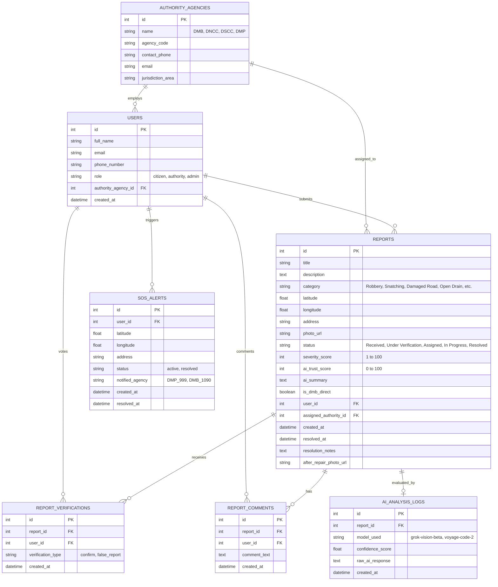

# Nirapod — Database (ER) Diagram & PostgreSQL Schema Design

This document describes the relational database design for **Nirapod**, optimized for **PostgreSQL**. The schema emphasizes spatial query performance, strict referential integrity, auditability, and scalability for city-wide concurrent reporting.

---

## 1. Entity-Relationship (ER) Diagram



---

## 2. Table Structures & PostgreSQL Data Types

### `users`
| Column | Type | Nullable | Description |
| :--- | :--- | :--- | :--- |
| `id` | `SERIAL / INTEGER` | No (PK) | Unique user identifier |
| `full_name` | `VARCHAR(150)` | No | Full display name of citizen or official |
| `email` | `VARCHAR(255)` | No (Unique) | Email address for authentication |
| `phone_number` | `VARCHAR(50)` | Yes | Contact number for SMS alerts / verification |
| `role` | `VARCHAR(50)` | No | Role enum: `'citizen'`, `'authority'`, `'admin'` |
| `authority_agency_id` | `INTEGER` | Yes (FK) | References `authority_agencies.id` if role is authority |
| `created_at` | `TIMESTAMP WITH TIME ZONE` | No | Timestamp of user creation |

### `authority_agencies`
| Column | Type | Nullable | Description |
| :--- | :--- | :--- | :--- |
| `id` | `SERIAL / INTEGER` | No (PK) | Unique authority identifier |
| `name` | `VARCHAR(150)` | No | Agency name (e.g., Disaster Management Board) |
| `agency_code` | `VARCHAR(50)` | No (Unique) | Code (e.g., `'DMB'`, `'DNCC'`, `'DSCC'`, `'DMP'`) |
| `contact_phone` | `VARCHAR(50)` | No | Emergency / dispatch contact number |
| `email` | `VARCHAR(255)` | No | Official dispatch email |
| `jurisdiction_area` | `VARCHAR(150)` | Yes | Primary area (e.g., `'Dhaka North'`, `'National'`) |

### `reports`
| Column | Type | Nullable | Description |
| :--- | :--- | :--- | :--- |
| `id` | `SERIAL / INTEGER` | No (PK) | Unique report identifier |
| `title` | `VARCHAR(200)` | No | Brief headline of the hazard or hotspot |
| `description` | `TEXT` | No | Detailed description of the situation |
| `category` | `VARCHAR(100)` | No | Hazard type enum (`'Robbery'`, `'Damaged Road'`, etc.) |
| `latitude` | `DOUBLE PRECISION` | No | WGS84 Latitude coordinate |
| `longitude` | `DOUBLE PRECISION` | No | WGS84 Longitude coordinate |
| `address` | `VARCHAR(255)` | No | Reverse-geocoded or user-specified landmark |
| `photo_url` | `VARCHAR(500)` | Yes | S3 / storage URL or base64 photo payload |
| `status` | `VARCHAR(50)` | No | Status: `'Received'`, `'Under Verification'`, etc. |
| `severity_score` | `INTEGER` | No | AI-calculated severity (1 to 100) |
| `ai_trust_score` | `INTEGER` | No | Community trust score (0 to 100) |
| `ai_summary` | `TEXT` | Yes | AI-generated 1-sentence action summary for officials |
| `is_dmb_direct` | `BOOLEAN` | No | Default `FALSE`; `TRUE` if Direct DMB Dispatch toggled |
| `user_id` | `INTEGER` | Yes (FK) | Submitting user ID |
| `assigned_authority_id`| `INTEGER` | Yes (FK) | Target authority agency ID |
| `created_at` | `TIMESTAMP WITH TIME ZONE` | No | Report submission timestamp |
| `resolved_at` | `TIMESTAMP WITH TIME ZONE` | Yes | Resolution timestamp |
| `resolution_notes` | `TEXT` | Yes | Action taken by authority |
| `after_repair_photo_url`| `VARCHAR(500)` | Yes | Evidence photo after repair/police deployment |

### `report_verifications`, `report_comments`, `sos_alerts`, & `ai_analysis_logs`
* Supporting relational tables that maintain full history of citizen upvotes, community discussions, emergency SOS activations, and AI evaluation audit logs.

---

## 3. Query Optimization & Indexing Strategy

1. **Geospatial Coordinate Indexes:**
   * Composite B-Tree index on `(latitude, longitude)` for high-speed bounding-box queries:
     ```sql
     CREATE INDEX idx_reports_coords ON reports (latitude, longitude);
     ```
   * *Note:* Designed to seamlessly upgrade to PostgreSQL `PostGIS` spatial indexes (`GEOMETRY(Point, 4326)`) using `GIST` indexing when scaling to millions of coordinates.
2. **Filtering & Status Indexes:**
   * Compound index on `(status, category, assigned_authority_id)` to ensure instant loading of authority command center dashboards:
     ```sql
     CREATE INDEX idx_reports_status_agency ON reports (status, assigned_authority_id);
     ```
3. **DMB Direct Dispatch Index:**
   * Partial index on `is_dmb_direct` for rapid polling by Disaster Management Board officials:
     ```sql
     CREATE INDEX idx_reports_dmb_direct ON reports (created_at DESC) WHERE is_dmb_direct = TRUE;
     ```
4. **Connection Pooling & Scalability:**
   * Managed via SQLAlchemy asynchronous/synchronous session pooling (`pool_size=20`, `max_overflow=10`) to handle high-concurrency spikes during hackathon demos and emergencies.
