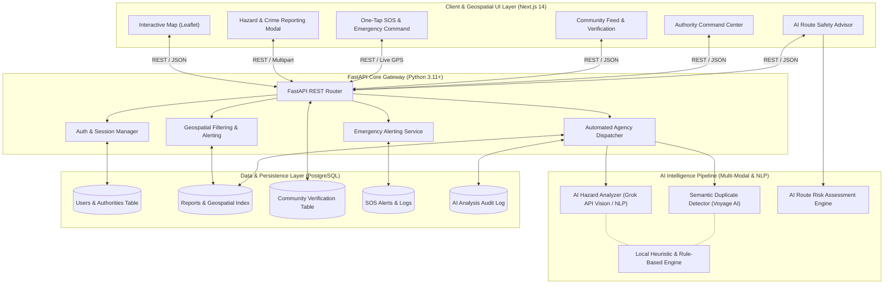

# Nirapod — System Architecture & Technical Design

## 1. High-Level Architectural Overview

Nirapod is structured as a modern, decoupled cloud application composed of three primary layers:
1. **Presentation & Interactive Geospatial Layer:** Built with Next.js 14 (App Router, TypeScript, Tailwind CSS, and React-Leaflet / OpenStreetMap).
2. **Application & AI Microservices Layer:** Built with Python 3.11+ and FastAPI, leveraging Pydantic v2 schemas, asynchronous REST endpoints, and integrated AI services (Grok API, Voyage AI, and local smart heuristics).
3. **Data Persistence & Geospatial Indexing Layer:** Designed around PostgreSQL with SQLAlchemy 2.0 ORM, optimized indexing for geographic coordinates and trust scoring, and SQLite fallback for frictionless local execution.

---

## 2. System Architecture Diagram (Mermaid & ASCII)



### ASCII System Architecture Breakdown

```
+---------------------------------------------------------------------------------------+
|                              CLIENT / BROWSER (Next.js 14)                            |
|  +---------------------+   +----------------------+   +----------------------------+  |
|  | Interactive Map UI  |   |  Direct DMB Dispatch |   |  One-Tap Emergency SOS     |  |
|  +---------------------+   +----------------------+   +----------------------------+  |
|  +---------------------+   +----------------------+   +----------------------------+  |
|  | AI Route Advisor    |   | Community Feed/Verify|   |  Authority Resolution Grid |  |
|  +---------------------+   +----------------------+   +----------------------------+  |
+------------------------------------------+--------------------------------------------+
                                           |  HTTP REST (JSON / Multipart)
                                           v
+---------------------------------------------------------------------------------------+
|                         APPLICATION SERVER (Python FastAPI)                           |
|                                                                                       |
|  +--------------------+  +---------------------+  +--------------------------------+  |
|  |  Reports Endpoint  |  |   AI Service Layer  |  | Automated Agency Routing Engine|  |
|  +--------------------+  +---------------------+  +--------------------------------+  |
|  +--------------------+  +---------------------+  +--------------------------------+  |
|  |   SOS Endpoints    |  |  Verification Engine|  | Authority Dashboard Endpoints  |  |
|  +--------------------+  +---------------------+  +--------------------------------+  |
+------------------+-----------------------+------------------------+-------------------+
                   |                       |                        |
                   v                       v                        v
+-----------------------+     +------------------------+     +--------------------------+
|  AI EXTERNAL SERVICES |     | POSTGRESQL / SQLALCHEMY|     | EXTERNAL NOTIFICATIONS   |
|  - Grok API (Vision)  |     | - Reports (Lat/Lng)    |     | - Disaster Mgmt Board    |
|  - Voyage AI (Embeds) |     | - Users & Authorities  |     | - City Corporations      |
|  - Smart Local Engine |     | - SOS Logs & Comments  |     | - Law Enforcement / 999  |
+-----------------------+     +------------------------+     +--------------------------+
```

---

## 3. Component Details & Design Responsibilities

### 3.1 Frontend Presentation Layer (Next.js 14)
* **Framework:** Next.js 14 with App Router, TypeScript, and Tailwind CSS.
* **Geospatial Visualization:** Leaflet / React-Leaflet with custom interactive SVG/HTML markers for different hazard categories (`Robbery`, `Snatching`, `Damaged Road`, `Open Drain`, `Missing Manhole Cover`, `Waterlogging`, `Poor Lighting`).
* **Client-Side State:** React Hooks and state management for real-time filtering, alert triggers, and seamless modal dialogs.
* **Performance:** Static generation for shell layouts, dynamic client-side hydration for Leaflet maps, and responsive mobile-first design.

### 3.2 Backend Core & API Layer (Python FastAPI)
* **Framework:** FastAPI with Pydantic v2 schemas for high-speed validation and automated OpenAPI (`/docs`) generation.
* **ORM:** SQLAlchemy 2.0 with asynchronous pattern support, abstracting database connectivity and allowing connection pooling.
* **Agency Routing Engine:** Evaluates report metadata (category, GPS location, DMB-direct toggle, AI severity) and automatically assigns the report to the corresponding authority agency.

### 3.3 AI Intelligence Micro-Layer
* **AI Vision & Text Analyzer:** Receives photo URLs/base64 and descriptions; uses Grok API (with simple fallback to keyword and heuristic severity models) to compute severity scores and executive summaries.
* **Duplicate Detection:** Calculates distance vectors (Haversine formula within 100 meters) combined with text similarity to detect duplicate reports and merge community upvotes.
* **Route Risk Prediction:** Evaluates geographic polygon risks across Dhaka and Gazipur neighborhoods, returning a synthesized safety advisory for commuters.

### 3.4 Data Persistence (PostgreSQL)
* **Schema Optimization:** Structured PostgreSQL schema with indexed latitude and longitude columns (`idx_report_coords`), category indexes, and timestamp indices for sub-millisecond query execution.
* **Portability:** Configured via `DATABASE_URL` environment variable, supporting both PostgreSQL in production and SQLite for instant local hackathon demonstration.
