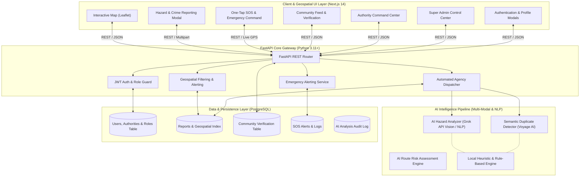

# Nirapod — System Architecture & Technical Design

## 1. High-Level Architectural Overview

Nirapod is structured as a modern, decoupled cloud application composed of four primary layers:
1. **Presentation & Interactive Geospatial Layer:** Built with Next.js 14 (App Router, TypeScript, Tailwind CSS, and React-Leaflet / OpenStreetMap).
2. **Role-Based Security & Authentication Layer:** JWT-based stateless authentication with direct bcrypt password hashing and Role-Based Access Control (`Guest`, `Citizen`, `Authority Admin`, `Super Admin`).
3. **Application & AI Microservices Layer:** Built with Python 3.11+ and FastAPI, leveraging Pydantic v2 schemas, asynchronous REST endpoints, and integrated AI services (Grok API, Voyage AI, and local smart heuristics).
4. **Data Persistence & Geospatial Indexing Layer:** Designed around PostgreSQL with SQLAlchemy 2.0 ORM, optimized indexing for geographic coordinates and trust scoring, and SQLite fallback for frictionless local execution.

---

## 2. System Architecture Diagram (Mermaid & ASCII)



---

## 3. Role-Based Access Control (RBAC) Specification

Nirapod enforces strict permission boundaries across four official roles:

```
+---------------------------------------------------------------------------------------------------+
| 1. GUEST               | Read-only access. Can view interactive map, public reports, and search.  |
|                        | Cannot submit reports, comment, verify, use SOS, or access dashboards.   |
+---------------------------------------------------------------------------------------------------+
| 2. CITIZEN             | Authenticated citizen. Can submit hazard/crime reports, comment, verify  |
|                        | reports, activate Emergency SOS, and update profile. Automatically       |
|                        | links logged-in user ID and name to submitted reports.                   |
+---------------------------------------------------------------------------------------------------+
| 3. AUTHORITY ADMIN     | Organization accounts for DMB, DNCC, DSCC, and DMP. Can view reports     |
|                        | assigned to their agency, update lifecycle status, attach after-repair   |
|                        | photo proof, and check up on citizen SOS alerts.                         |
+---------------------------------------------------------------------------------------------------+
| 4. SUPER ADMIN         | Full platform access. Can create/activate/deactivate authority accounts, |
|                        | manage all users, view audit activity logs, and manually assign reports. |
+---------------------------------------------------------------------------------------------------+
```

---

## 4. Component Details & Design Responsibilities

### 4.1 Frontend Presentation Layer (Next.js 14)
* **Framework:** Next.js 14 with App Router, TypeScript, and Tailwind CSS.
* **Authentication UI:** Comprehensive `AuthModal` supporting JWT Sign In, Citizen Registration, Password Recovery, and 1-Click Quick Demo Hackathon Accounts.
* **Geospatial Visualization:** Leaflet / React-Leaflet with custom interactive SVG/HTML markers for different hazard categories.

### 4.2 Backend Core & Security Layer (Python FastAPI)
* **Framework:** FastAPI with Pydantic v2 schemas for validation and OpenAPI (`/docs`) generation.
* **Security:** Stateless JWT bearer tokens (`pyjwt`) with direct bcrypt password hashing (`bcrypt.hashpw`).
* **ORM:** SQLAlchemy 2.0 with PostgreSQL optimization and SQLite local fallback.
