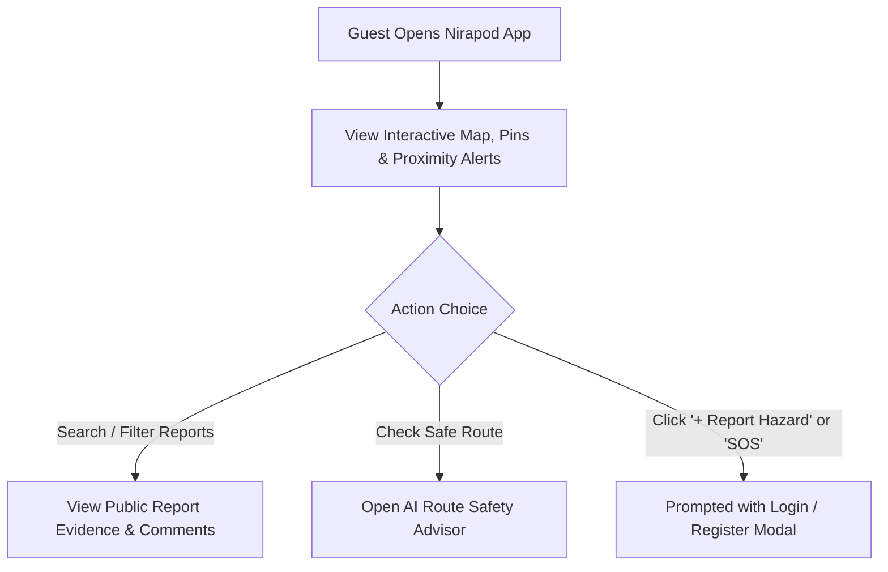
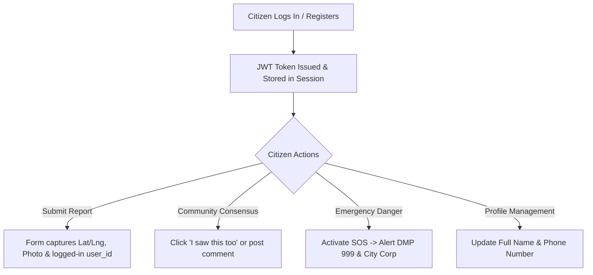
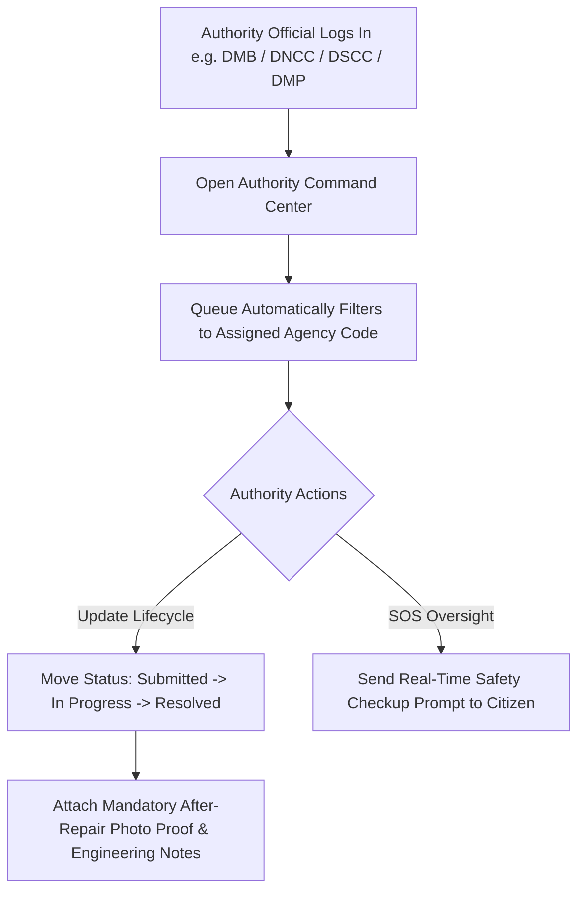
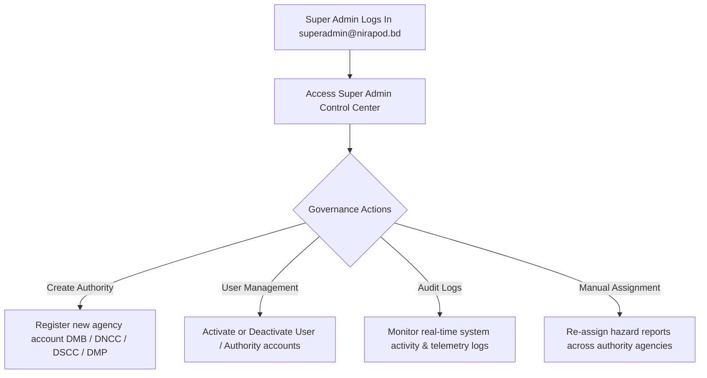

# Nirapod — Role-Based User Flow Diagrams

This document outlines the end-to-end user journeys in **Nirapod** across four official authentication roles: Guest, Citizen, Authority Admin, and Super Admin.

---

## 1. Guest Journey: Read-Only Public Map & Safe Route Exploration

---

## 2. Citizen Journey: Registration, Hazard Reporting & Emergency SOS

---

## 3. Authority Admin Journey: Organization Queue & SOS Citizen Checkup

---

## 4. Super Admin Journey: Platform Governance & Authority Account Management

