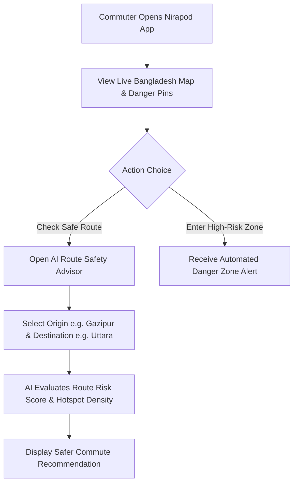
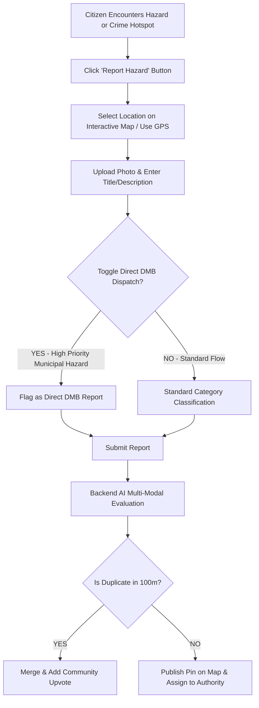
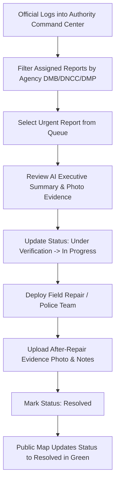

# Nirapod — User Flow Diagrams

This document outlines the end-to-end user journeys in **Nirapod** across four primary personas: Commuters, Vulnerable Citizens, Community Verifiers, and Government Authorities.

---

## 1. Commuter Journey: Interactive Map & Route Safety Advisor



---

## 2. Citizen Reporting Journey: Instant Hazard & Direct DMB Dispatch



---

## 3. Vulnerable Citizen Journey: One-Tap Emergency SOS

```
[ Citizen in Emergency / Robbery Danger ]
                 |
                 v
   [ Taps Emergency SOS Header Button ]
                 |
                 v
+----------------+----------------+
|  EMERGENCY COMMAND MODAL OPENS  |
+----------------+----------------+
                 |
                 +--------------------------------+--------------------------------+
                 |                                |                                |
                 v                                v                                v
     [ Audio/Visual Siren Active ]      [ Live GPS Location Broadcast ]     [ Quick Call 999 / 1090 ]
                 |                                |                                |
                 +--------------------------------+--------------------------------+
                                                  |
                                                  v
                              [ Authority Dashboard Flashes SOS Banner ]
```

---

## 4. Government Authority Journey: Resolution Tracking & Management


