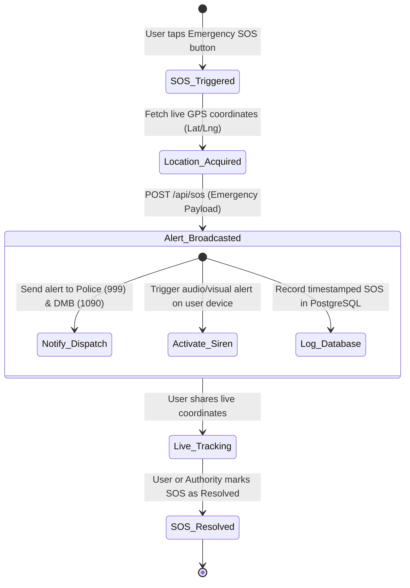

# Nirapod — Workflow Diagrams & Operational Pipelines

This document details the operational workflows of the **Nirapod** platform, illustrating how data flows from citizen submission to authority resolution, community verification, and emergency SOS handling.

---

## 1. Automated Hazard & Crime Hotspot Reporting Workflow


---

## 2. Direct Disaster Management Board (DMB) Dispatch Workflow

The Problem Statement specifically requires users to be able to send a picture of a hazard along with a short written description straight to the **Disaster Management Board (DMB)** so damaged infrastructure gets flagged with clear visual and contextual evidence.

```
[ Citizen Toggles "Direct DMB Dispatch" ]
                  |
                  v
[ Captures Photo + Coordinates + Short Description ]
                  |
                  v
[ Backend AI Evaluates Structural/Emergency Severity ]
                  |
                  +-----------------------------------+
                  |                                   |
                  v                                   v
    [ Flagged as High Priority ]            [ Attached Visual & Context Proof ]
                  |                                   |
                  +-----------------+-----------------+
                                    |
                                    v
     [ DIRECT DISPATCH: Bypasses Standard Municipal Queue ]
                                    |
                                    v
     [ Assigned Directly to Disaster Management Board (DMB 1090) ]
                                    |
                                    v
     [ Authority Dashboard Displays Alert with Red Urgent Badge ]
```

---

## 3. One-Tap Emergency SOS Command Workflow



---

## 4. Community Verification & Trust Score Lifecycle

To maintain trustworthy and current information, Nirapod incorporates a community consensus mechanism that dynamically updates a report's `ai_trust_score`.

```
                        +-------------------------------+
                        |    NEW REPORT SUBMITTED       |
                        |      Initial Score: 50        |
                        +---------------+---------------+
                                        |
                 +----------------------+----------------------+
                 |                                             |
                 v                                             v
       [ COMMUNITY CONFIRMS ]                         [ COMMUNITY FLAGS ]
   User clicks "I saw this too"                    User clicks "False Report"
                 |                                             |
                 v                                             v
     +-----------------------+                     +-----------------------+
     | Trust Score Increases |                     | Trust Score Decreases |
     |  Score = Score + 10   |                     |  Score = Score - 15   |
     +-----------+-----------+                     +-----------+-----------+
                 |                                             |
                 +----------------------+----------------------+
                                        |
                                        v
                        +-------------------------------+
                        |   TRUST SCORE EVALUATION      |
                        +---------------+---------------+
                                        |
            +---------------------------+---------------------------+
            |                           |                           |
            v                           v                           v
   [ Score >= 80 ]             [ Score 40 to 79 ]          [ Score <= 25 ]
   VERIFIED COMMUNITY          UNDER VERIFICATION          AUTOMATICALLY FLAGGED
   High-priority badge         Standard map display        Hidden from main view
   displayed on map            and authority queue         pending admin review
```
